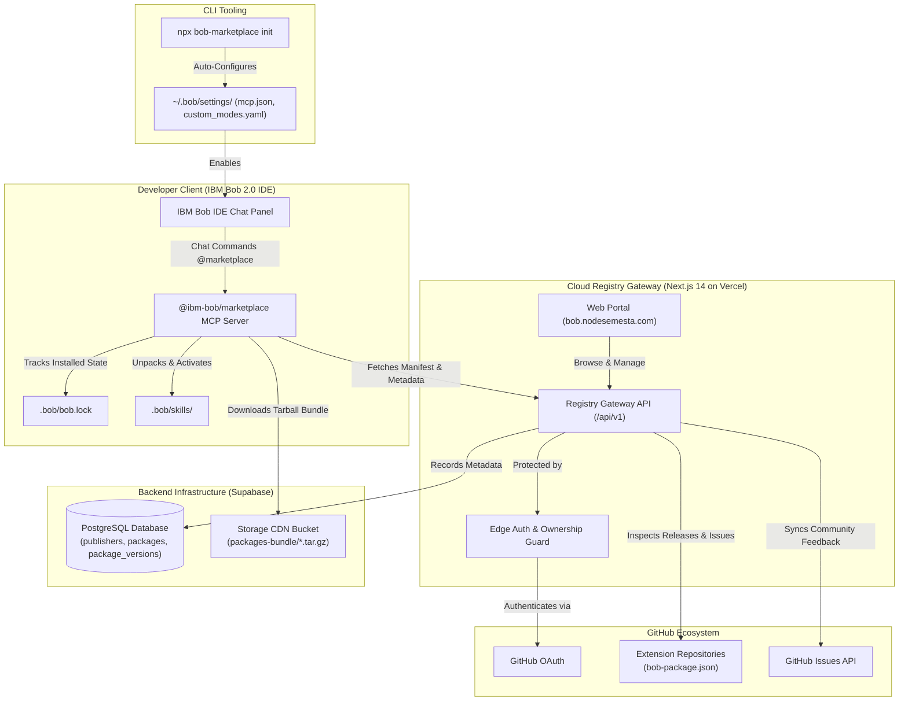

# Bob Marketplace

> **The Decentralized Package Manager & Web Registry for IBM Bob 2.0 AI Extensions**

[](https://bob.nodesemesta.com)
[](https://ibm.com)
[](https://nextjs.org)
[](https://supabase.com)
[](LICENSE)

---

## 1. Overview

**Bob Marketplace** is the first unified, decentralized package management ecosystem built natively for **IBM Bob 2.0**. It solves the problem of extension fragmentation in modern agentic coding environments by providing a friction-free bridge between open-source extension developers and developers working inside IBM Bob IDE.

With Bob Marketplace, developers can install, manage, inspect, and remove autonomous **Agents**, **Skills**, **Plugins**, **Custom Tools**, **MCP Servers**, **Hooks**, **Rules**, and **Configurations** using natural chat commands directly inside IBM Bob IDE—without manual JSON editing or path configuration.

---

## 2. Key Highlights & Features

- **Zero-Friction One-Line Setup**: Run `npx bob-marketplace init` once to automatically configure IBM Bob global mode files (`~/.bob/settings/custom_modes.yaml`) and MCP tool servers (`~/.bob/settings/mcp.json`).
- **Native In-IDE Chat Commands**: Manage extensions right from the chat panel using `@marketplace add <name>`, `@marketplace list`, and `@marketplace remove <name>`.
- **Public Discovery Web Registry ([bob.nodesemesta.com](https://bob.nodesemesta.com))**: Search and filter extensions across 8 taxonomy categories with live GitHub repository stars and fork counts.
- **Publisher Workspace & Ownership Verification**: GitHub OAuth integration with strict ownership guards—developers can only publish and update repositories belonging to their authenticated GitHub account.
- **One-Click Release Updates**: The publisher dashboard automatically detects when a new version is pushed to GitHub, allowing one-click publishing of new releases directly to Supabase PostgreSQL and Storage CDN.
- **Community Issue Tracking**: Real-time GitHub issues integration on the publisher dashboard to monitor user feedback, bug reports, and feature requests.
- **Enterprise Security & Sandbox Protection**: Built-in Zod schema validation for manifests, strictly sanitizes file paths against directory traversal attacks, and isolates runtime execution.

---

## 3. System Architecture



---

## 4. Quick Start: IBM Bob IDE Setup

To enable `@marketplace` commands inside your IBM Bob IDE, run this single command in your terminal:

```bash
npx bob-marketplace init
```

The CLI automatically:
1. Detects your IBM Bob user home directory (`~/.bob/settings/`).
2. Registers the `@marketplace` Custom Mode in `custom_modes.yaml`.
3. Configures the `@ibm-bob/marketplace` MCP server in `mcp.json`.
4. Creates necessary runtime directories.

After running the command, open or restart **IBM Bob IDE**, select the **Marketplace** mode in the chat dropdown, or type `@marketplace` directly in the prompt.

---

## 5. In-IDE Usage Guide

### Install an Extension
```text
@marketplace add sample
```
*Downloads the package bundle from the Supabase CDN, verifies its contents against `bob-package.json`, unpacks declared skills and tools into `.bob/skills/`, and registers it in `.bob/bob.lock`.*

### List Installed Extensions
```text
@marketplace list
```
*Displays all active extensions in the workspace, their installed version, category, and maintainer.*

### Remove an Extension
```text
@marketplace remove sample
```
*Cleanly removes the extension files, unlinks skills, and updates the local lockfile.*

---

## 6. Publisher Guide: Building & Publishing Extensions

### Step 1: Create `bob-package.json`
Add a `bob-package.json` manifest at the root of your GitHub repository:

```json
{
  "name": "sample",
  "display_name": "Local Codebase Explainer",
  "version": "1.0.0",
  "description": "An intelligent skill that autonomously inspects and explains the active codebase.",
  "type": "skill",
  "keywords": ["onboarding", "codebase-explainer", "architecture"],
  "files": [
    { "src": "skills/explainer/SKILL.md", "dest": ".bob/skills/sample/SKILL.md" }
  ],
  "triggers": {
    "slash_commands": ["/explain"]
  }
}
```

### Step 2: Publish via Web Portal
1. Visit [bob.nodesemesta.com/login](https://bob.nodesemesta.com/login) and sign in with GitHub.
2. Navigate to [Publish Package](https://bob.nodesemesta.com/publish).
3. Paste your public GitHub repository URL (e.g., `https://github.com/your-username/your-repo`).
4. Click **Inspect Repository** &rarr; **Publish to Marketplace**.
5. Your package is instantly packaged, uploaded to the Supabase Storage CDN, and available for `@marketplace add` globally!

### Step 3: Releasing Updates (Automated Version Detection)
When you update your package:
1. Bump the `"version"` field in your repository's `bob-package.json` and push to GitHub.
2. Open your [Publisher Dashboard](https://bob.nodesemesta.com/dashboard) and click **Manage**.
3. The dashboard detects the new version from GitHub automatically.
4. Click **Release Update**—the new release is packaged and deployed in one click.

---

## 7. Supported Taxonomy Categories

Bob Marketplace supports 8 specialized extension types tailored for IBM Bob 2.0:

| Category | Identifier | Description |
| :--- | :--- | :--- |
| **Agents** | `agent` | Autonomous AI agents, specialized personas, and multi-turn planners. |
| **Skills** | `skill` | Slash-command skills and prompt templates (`.bob/skills/`). |
| **Plugins** | `plugin` | Rich workflow automation and external runtime tool bundles. |
| **Tools** | `tool` | Specialized single-purpose execution utilities and CLI scripts. |
| **MCP Servers** | `mcp` | Model Context Protocol servers exposing standard tool interfaces. |
| **Hooks** | `hook` | Lifecycle event listeners (pre-commit, post-build, prompt transforms). |
| **Rules** | `rule` | Workspace behavioral instructions and architectural constraints. |
| **Configs** | `config` | Shared project presets, coding conventions, and linter settings. |

---

## 8. Monorepo Repository Structure

```text
BobMarketplace/
├── bob_sessions/                      # IBM Bob IDE session verification & evidence
│   ├── README.md                      # Verification walkthrough & compliance matrix
│   ├── task/                          # Modular engineering task specifications (A to G)
│   └── data/                          # High-resolution IDE session captures
│
├── src/                               # Web Registry & Gateway Portal (Next.js 14)
│   ├── app/                           # App Router (Marketplace, Auth, Dashboard, REST API)
│   │   ├── (marketplace)/             # Public catalog, search, package detail views
│   │   ├── (dashboard)/               # Publisher workspace, management, release controls
│   │   ├── (auth)/                    # Centered GitHub OAuth authentication
│   │   └── api/v1/                    # Public API (packages, publish, download, updates)
│   ├── components/                    # UI Components (Sidebar, CliBanner, Cards, Modals)
│   ├── lib/                           # Core Libraries
│   │   ├── gateway/                   # Manifest validator & tarball packaging engine
│   │   ├── github/                    # Live GitHub Stars, Forks & Issues fetcher
│   │   └── supabase/                  # Supabase SSR client, admin client & schema
│   └── middleware.ts                  # Edge Route Protection & Authentication Guard
│
├── packages/
│   ├── cli/                           # bob-marketplace CLI (npx bob-marketplace init)
│   │   ├── bin/cli.js                 # Executable entrypoint
│   │   └── index.js                   # Interactive & automated initialization logic
│   └── mcp-server/                    # @ibm-bob/marketplace MCP Server
│       ├── index.js                   # MCP protocol server handling add, list, remove
│       └── package.json               # MCP package metadata
│
├── examples/
│   └── sample-extension/              # Reference Bob skill blueprint with bob-package.json
│
├── tailwind.config.ts                 # IBM Carbon-inspired dark theme configuration
├── tsconfig.json                      # Strict TypeScript compiler options & path mappings
├── package.json                       # Monorepo root dependencies
└── README.md                          # Official documentation
```

---

## 9. Security Model & Sandbox Isolation

- **Path Traversal Protection**: The Gateway Manager enforces strict regular expressions preventing relative path traversal (`../`) in manifest target destinations.
- **Cryptographic Immutability**: Published package versions are immutable. Once a version tag (e.g., `v1.0.0`) is registered, its archive cannot be modified or overwritten.
- **Strict Ownership Guards**: The Registry API authenticates publishers via GitHub OAuth session cookies and cryptographically verifies repository ownership before allowing publishing or version updates.
- **Local Sandbox Execution**: Extensions installed in IBM Bob IDE reside within user-scoped workspace boundaries (`.bob/skills/` and `.bob/bob.lock`).

---

## 10. IBM Bob IDE Verification & Evaluation Evidence

Bob Marketplace was developed and validated natively within the official **IBM Bob IDE** Linux amd64 environment in strict compliance with all IBM Bob 2.0 Hackathon evaluation criteria.

Comprehensive documentation, empirical evidence, and high-resolution session captures detailing the autonomous development and runtime execution lifecycle are available in the dedicated verification directory:

- **[IBM Bob Task Session Verification & Evidence Report](bob_sessions/README.md)**:
  - **Architectural Blueprint Planning**: Master blueprint synthesis conducted inside IBM Bob IDE (`plan.png`).
  - **Modular Engineering Breakdown**: Complete technical specifications and recorded execution states across seven distinct modules (`taskA` through `taskG`).
  - **Global CLI Setup**: Automated configuration of `~/.bob/settings/mcp.json` and `custom_modes.yaml` (`installation.png`).
  - **Conversational Installation**: In-IDE chat execution via `@marketplace add sample` (`successaddpkg.png`).
  - **Autonomous Skill Invocation**: Native slash command execution `/sample run` and automated repository analysis synthesis (`sampleRun.png` & `sampleRunDetailed.png`).
  - **Hackathon Evaluation Matrix**: Verification table fulfilling 100% of official IBM jury criteria.

---

## 11. Links & Resources

- **Production Registry**: [https://bob.nodesemesta.com](https://bob.nodesemesta.com)
- **GitHub Repository**: [https://github.com/nodesmesta/BobMarketplace](https://github.com/nodesmesta/BobMarketplace)
- **IBM Bob 2.0**: [IBM Developer Platform](https://ibm.com)
- **LabLab.ai Submission**: [IBM Bob 2.0 Hackathon](https://lablab.ai)

---

## 12. License

This project is licensed under the [MIT License](LICENSE).
